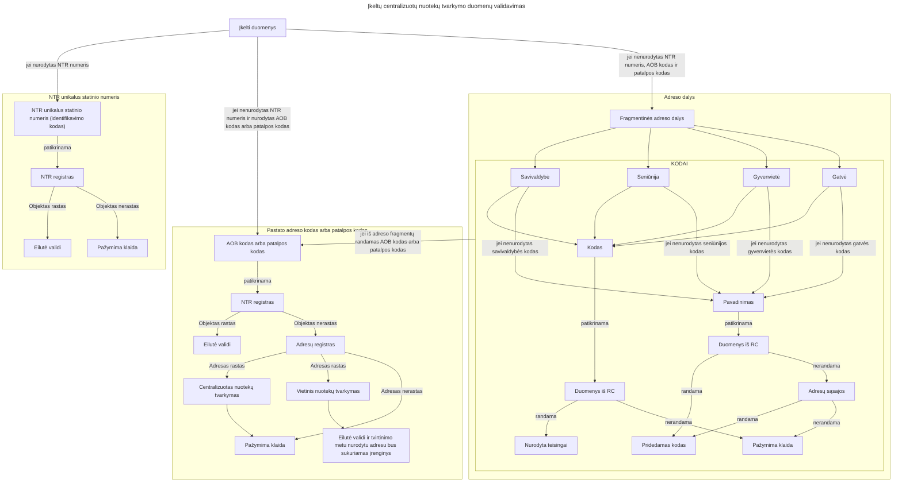

```mermaid
---
title: Įkeltų centralizuotų nuotekų tvarkymo duomenų validavimas
---

flowchart TD

DUOMENYS["Įkelti duomenys"]
NTR["NTR unikalus statinio numeris (identifikavimo kodas)"]
AOB_KODAS["AOB kodas arba patalpos kodas"]
ADRESO_DALYS["Fragmentinės adreso dalys"]
NTR_REGISTRAS["NTR registras"]
NTR_REGISTRAS2["NTR registras"]
ADRESU_REGISTRAS["Adresų registras"]
KLAIDA["Pažymima klaida"]
KLAIDA1["Pažymima klaida"]
SAVIVALDYBE["Savivaldybė"]
SENIUNIJA["Seniūnija"]
GYV_VIETA["Gyvenvietė"]
GATVE["Gatvė"]
KODAS["Kodas"]
PAVADINIMAS["Pavadinimas"]
DUOMENYS_RC["Duomenys iš RC"]
DUOMENYS_RC2["Duomenys iš RC"]
TEISINGA["Nurodyta teisingai"]
PRIDEDAMAS_KODAS["Pridedamas kodas"]
ADRESU_SASAJOS["Adresų sąsajos"]
KLAIDA_FRAG["Pažymima klaida"]


VALIDI["Eilutė validi"]
VALIDI1["Eilutė validi"]

SUKURIAMAS_IRENGINYS["Eilutė validi ir tvirtinimo metu nurodytu adresu bus sukuriamas įrenginys"]

CENTRALIZUOTAS["Centralizuotas nuotekų tvarkymas"]
VIETINIS["Vietinis nuotekų tvarkymas"]

DUOMENYS--->|jei nurodytas NTR numeris|NTR
DUOMENYS--->|jei nenurodytas NTR numeris ir nurodytas AOB kodas arba patalpos kodas|AOB_KODAS
DUOMENYS--->|jei nenurodytas NTR numeris, AOB kodas ir patalpos kodas|ADRESO_DALYS

subgraph NTR unikalus statinio numeris
    NTR --> |patikrinama| NTR_REGISTRAS --> |Objektas rastas| VALIDI
    NTR_REGISTRAS --> |Objektas nerastas| KLAIDA
    end
subgraph Pastato adreso kodas arba patalpos kodas
 AOB_KODAS --> |patikrinama| NTR_REGISTRAS2 --> |Objektas rastas| VALIDI1
 NTR_REGISTRAS2 --> |Objektas nerastas| ADRESU_REGISTRAS
 ADRESU_REGISTRAS--> |Adresas rastas|CENTRALIZUOTAS --> KLAIDA1
 ADRESU_REGISTRAS--> |Adresas rastas| VIETINIS --> SUKURIAMAS_IRENGINYS
 ADRESU_REGISTRAS--> |Adresas nerastas| KLAIDA1
end
subgraph Adreso dalys
ADRESO_DALYS
subgraph KODAI
  SAVIVALDYBE --> KODAS
  SENIUNIJA --> KODAS
  GYV_VIETA --> KODAS
  GATVE --> KODAS
  SAVIVALDYBE --->|jei nenurodytas savivaldybės kodas| PAVADINIMAS
  SENIUNIJA ---> |jei nenurodytas seniūnijos kodas|PAVADINIMAS
  GYV_VIETA ---> |jei nenurodytas gyvenvietės kodas|PAVADINIMAS
  GATVE ---> |jei nenurodytas gatvės kodas|PAVADINIMAS
  KODAS --> |patikrinama| DUOMENYS_RC --> |randama| TEISINGA
  DUOMENYS_RC --> |nerandama| KLAIDA_FRAG
  PAVADINIMAS --> |patikrinama| DUOMENYS_RC2 --> |randama| PRIDEDAMAS_KODAS
DUOMENYS_RC2 --> |nerandama| ADRESU_SASAJOS--> |randama| PRIDEDAMAS_KODAS
ADRESU_SASAJOS --> |nerandama| KLAIDA_FRAG
end

end

ADRESO_DALYS --> SAVIVALDYBE
ADRESO_DALYS --> SENIUNIJA
ADRESO_DALYS --> GYV_VIETA
ADRESO_DALYS --> GATVE
KODAI --> |jei iš adreso fragmentų randamas AOB kodas arba patalpos kodas| AOB_KODAS
```
